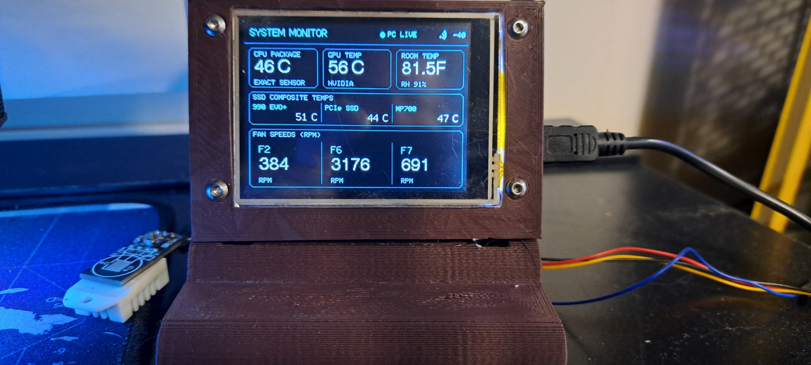

# ESP32 Room + PC Display



This project turns the ESP32-2432S028R into a local dashboard showing:

- the exact LibreHardwareMonitor **CPU Package** temperature
- NVIDIA GPU temperature
- DHT22/AM2302 room temperature and humidity
- the three useful motherboard fan speeds: F2, F6, and F7
- the composite temperature of up to three SSDs
- the current Windows media title, including compatible browser/YouTube sessions
- a full-width media title and artist area
- media source and play/pause state, plus progress and timing for Spotify

It does **not** use touch and it does **not** log or upload readings to an external site. The Windows companion keeps only a small, entry-limited diagnostic log locally beside the script.

## Part 1 — upload the ESP32 sketch

1. Keep every file in this folder together.
2. Copy `secrets.example.h` to a new file named `secrets.h`.
3. Edit `secrets.h`: enter your Wi-Fi name and password, then replace the
   example `DISPLAY_API_KEY` with a private value of your choice.
4. Open `Room_PC_Display.ino` in Arduino IDE.
5. Select **Tools > Board > ESP32 Arduino > ESP32 Dev Module**.
6. Select the ESP32's COM port.
7. Upload the sketch.

`secrets.h` is intentionally ignored by Git so Wi-Fi credentials cannot be
committed accidentally.

The display should immediately show the monitoring page and begin connecting to Wi-Fi. The DHT22 reading appears after its first valid measurement. Until the Windows program connects, the header shows the ESP32's local IP address.

The sketch requires:

- **DHT sensor library** by Adafruit
- **Adafruit Unified Sensor**
- **TFT_eSPI** by Bodmer

Your TFT_eSPI setup is already confirmed working by the image test. Do not replace it unless the screen becomes white after a library reinstall/update. `TFT_eSPI_User_Setup_CYD.h` is included as a backup and follows the supplied Random Nerd Tutorials configuration.

## Part 2 — prepare CPU-temperature monitoring

GPU temperature comes directly from NVIDIA's `nvidia-smi`. The exact **CPU Package** sensor, system fans, and SSD composite temperatures come from LibreHardwareMonitor.

1. Download LibreHardwareMonitor from its official GitHub releases page:
   <https://github.com/LibreHardwareMonitor/LibreHardwareMonitor/releases>
2. Extract and run `LibreHardwareMonitor.exe`.
3. Open **Options > Remote Web Server > Set Port** and leave the displayed network interface selected. It might show your PC's LAN address, such as `10.0.0.64`, instead of `127.0.0.1`; that is correct.
4. Enable **Options > Remote Web Server > Run**.
5. Leave LibreHardwareMonitor running. It may need **Run as administrator** for all motherboard, fan, CPU, and storage sensors to appear.

Test the blue address shown in LibreHardwareMonitor's Set Port window, adding `data.json` at the end. For example: `http://10.0.0.64:8085/data.json`. The companion automatically tries localhost and the PC's active local IPv4 addresses.

## Part 3 — run the Windows companion

1. Copy `pc_secrets.example.py` to a new file named `pc_secrets.py`.
2. Edit `pc_secrets.py` and enter the exact same `DISPLAY_API_KEY` used in
   `secrets.h`.
3. Double-click `1_INSTALL_PC_SENDER.bat` once.
4. For normal use, double-click `2_RUN_PC_SENDER_TRAY.bat`. Use `2_RUN_PC_SENDER.bat` when you want the visible diagnostic console.
5. If Windows Firewall asks, allow Python on **Private networks** so automatic ESP32 discovery can work.

`pc_secrets.py` is also ignored by Git.

The visible diagnostic console prints each update as it is sent. The ESP32 normally discovers automatically. If discovery fails:

1. Read the IP address shown on the ESP32 screen.
2. Open `pc_sender.py` in Notepad.
3. Change `DISPLAY_IP = ""` near the top to that address, for example:

   ```python
   DISPLAY_IP = "192.168.1.123"
   ```

4. Save the file and restart the sender from the tray menu, or run `2_RUN_PC_SENDER.bat` again.

### Recommended: run from the Windows system tray

After the one-time installation, double-click `2_RUN_PC_SENDER_TRAY.bat`. Its command window closes immediately, and a small monitor icon appears in the Windows notification area. You may need to click the notification-area arrow to see it.

Right-click the tray icon for:

- **View log** — opens `pc_sender.log` in Notepad
- **Open project folder**
- **Restart sender** (or **Start sender** if it stopped)
- **Stop and exit** — stops the sender and removes the tray icon

If the sender process exits unexpectedly, the tray controller restarts it automatically after two seconds. It stops trying after five unexpected exits within five minutes so a persistent fault cannot create an endless restart loop; use **View log** before starting it again.

The older `2_RUN_PC_SENDER_HIDDEN.vbs` remains for existing shortcuts, but it now opens this same tray controller instead of launching an invisible sender.

Important events and connection problems are written to `pc_sender.log`. The log has a hard ceiling of 1,000 entries. When it passes that ceiling, the oldest entries are deleted and the newest 800 are retained. Old numbered backup logs from earlier versions are removed automatically.

To start the tray controller automatically with Windows:

1. Press **Win+R** and enter `shell:startup`.
2. Create a shortcut in that folder pointing to `2_RUN_PC_SENDER_TRAY.bat`.

Duplicate tray and sender instances are blocked automatically. Use the visible launcher only after choosing **Stop and exit** from the tray menu.

## Expected behavior

- When nothing is actively playing—or media is paused—the ESP32 shows the System Monitor page.
- When Windows reports that media is actively playing, the ESP32 automatically switches to the full-screen Now Playing page. Stopping or pausing returns it to System Monitor.
- The Now Playing page uses the full content width for the title and artist. Spotify can use up to three title lines and retains its progress bar, elapsed time, and duration. Other sources can use up to five title lines.
- YouTube, browsers, VLC, and every non-Spotify source omit start time, progress bar, and duration so their titles have more room.
- The System Monitor page shows CPU Package, GPU, room temperature/humidity, F2, F6, F7, and up to three SSD composite temperatures. Permanently stopped F1, F3, F4, F5, GPU1, and GPU2 readings are hidden.
- A missing displayed fan sensor shows `--`.
- Room temperature and humidity continue working even when the PC is off.
- PC readings turn to `--` after 15 seconds without updates; while disconnected, the header shows the display's local IP for easy reconnection.
- Media information comes from the Windows system media session. Opera GX, YouTube, Spotify, VLC, Edge, Chrome, and similar apps generally appear when they publish media metadata to Windows.
- Display updates use a five-second timeout and retry once before counting a failed cycle. Automatic discovery runs again only after six consecutive failed cycles.
- Unexpected Python-level sender errors are written to the log and recover automatically after three seconds. If the entire process exits, the tray controller provides a second recovery layer by starting it again.
- If you installed an earlier version of the companion, no dependency reinstall is needed for this update.
- Long titles are shortened or wrapped to fit the 320 × 240 screen.
- No data is sent beyond the local network by this project.

## Hardware and display configuration

- Board: ESP32-2432S028R / 2.8-inch CYD
- Arduino board selection: ESP32 Dev Module
- Display rotation: landscape, rotation 1
- Backlight: GPIO 21, active HIGH
- DHT22/AM2302 data: GPIO 27
- Touch: unused

Reference supplied for this device:
<https://randomnerdtutorials.com/cheap-yellow-display-esp32-2432s028r/>
